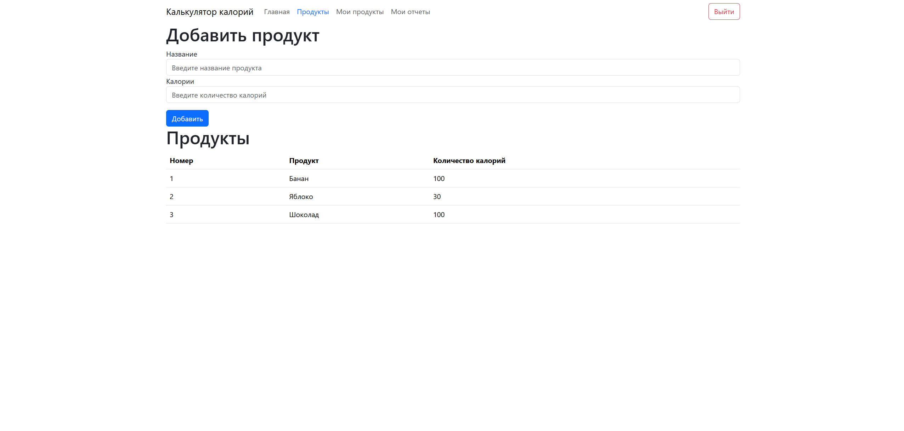

# Программа для подсчета калорий

Программа позволяет записывать съеденные продукты и отслеживать количество съеденных калорий.

## Как запустить проект

1. Выполните команду `docker compose up`
2. Готово

## Как использовать программу

1. Запустите проект
2. Откройте `localhost:8080`
3. Зарегистрируйтесь
4. Войдите в аккаунт после регистрации
5. Добавьте продукты и калории на вкладке [Продукты](localhost:8080/products) - это общая база продуктов
6. Добавьте продукты на вкладке [Мои продукты](localhost:8080/my-products) - это съеденные продукты из общей базы
7. Создайте отчет на вкладке [Мои отчеты](localhost:8080/my-reports) - в отчете хранится информация о съеденных продуктах и калориях за указанный период (границы периода можно не указывать)
